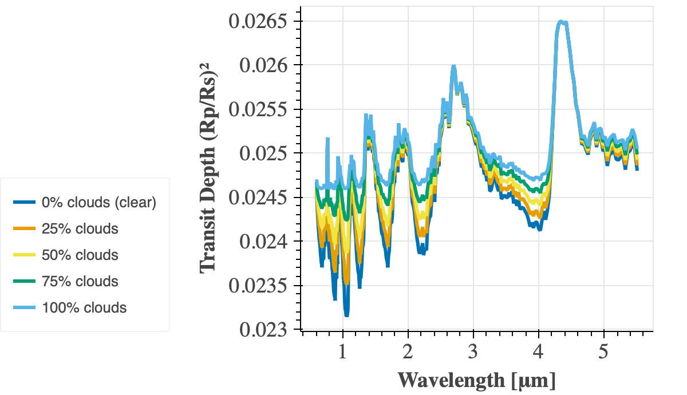
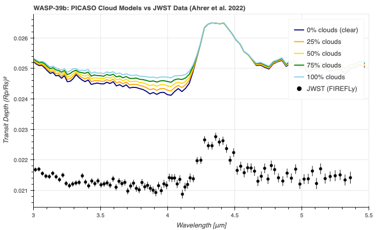
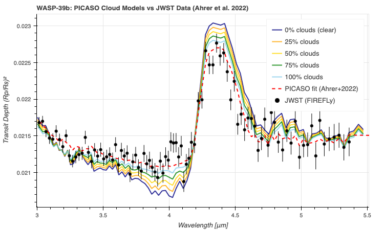

# WASP-39b Patchy Cloud Transmission Spectrum

## Overview

This project models the transmission spectrum of **WASP-39b**, a hot Jupiter observed by JWST, under varying **terminator cloud fractions** using the **PICASO radiative transfer framework**.

The goal is to investigate how **partial cloud coverage modifies observed transmission spectra** and how this affects the interpretation of atmospheric composition.

JWST comparison data are taken from:

Ahrer et al. (2022), *Identification of carbon dioxide in an exoplanet atmosphere*, Nature  
https://doi.org/10.1038/s41586-022-05269-w

---

## Scientific Question

How does partial cloud coverage at the planetary terminator alter the observed transmission spectrum, and to what extent can cloud-induced spectral changes mimic differences in atmospheric composition?

This addresses one of the central challenges in exoplanet atmospheric characterization:

> Can an atmosphere appear chemically different simply because clouds obscure part of the atmosphere?

---

## Background

During a planetary transit, a small fraction of stellar light passes through the atmosphere before reaching the observer.

Different molecules absorb at specific wavelengths, producing a **transmission spectrum**.

Clouds complicate this interpretation because they can suppress absorption features and produce spectra that resemble atmospheres with different chemical abundances.

---

## Method

Two end-member transmission spectra were computed:

### Clear atmosphere (0% cloud coverage)
- No cloud opacity
- Full atmospheric contribution

### Fully cloudy atmosphere (100% cloud coverage)
- Grey cloud deck
- Cloud pressure: **1 bar**
- Optical depth: **τ = 10**

Intermediate cloud fractions (**25%, 50%, 75%**) were generated by linearly combining the clear and cloudy spectra following the **patchy cloud parameterization implemented in PICASO**:
```math
S_{mix}=(1-f)S_{clear}+fS_{cloud}
```

where:
- `f` = cloud fraction
- `S_clear` = clear atmosphere transmission spectrum
- `S_cloud` = fully cloudy transmission spectrum
---

## Planet Parameters — WASP-39b

| Parameter | Value |
|----------|-------|
| Mass | 0.28 MJup |
| Radius | 1.27 RJup |
| Stellar Teff | 5400 K |
| Stellar log(g) | 4.5 |
| Stellar Radius | 0.895 RSun |
| Stellar Model | Phoenix |

---

# Results

## Transmission Spectrum

### Figure 1 — Patchy Cloud Transmission Models



**Figure 1.** Simulated transmission spectra of WASP-39b for increasing terminator cloud fractions (0–100%) generated with PICASO. Increasing cloud coverage progressively suppresses spectral structure by limiting the atmospheric depth probed during transit. Water absorption bands near **0.9, 1.4 and 1.9 μm** become increasingly muted, and the **CO₂ feature at 4.3 μm** collapses substantially.

---

## Comparison with JWST Observations

### Figure 2 — Cloud Fraction Models Compared with JWST Data



**Figure 2.** Transmission spectra for varying cloud fractions compared with published JWST observations of WASP-39b (Ahrer et al. 2022). Although the model reproduces broad spectral behaviour, an offset in absolute transit depth remains due to the simplified atmospheric assumptions adopted here.

---

## Normalized Comparison

### Figure 3 — Relative Spectral Shape Comparison



**Figure 3.** Same comparison after normalizing both observations and models to their respective mean transit depths. Removing the absolute offset isolates the shape of spectral features and highlights the effect of cloud fraction on molecular absorption amplitudes.

---

## Main Results

As cloud fraction increases:

- Water absorption bands become progressively muted
- The CO₂ feature near **4.3 μm** decreases substantially
- Spectra become increasingly flat
- Intermediate cloud fractions produce spectra that can resemble atmospheres with lower molecular abundances

---

## Note on Absolute Offset

The model transmission spectra sit approximately **0.003 above the JWST observations** in absolute transit depth. This offset is expected. The atmospheric profile used in this project corresponds to PICASO's built-in generic hot Jupiter atmosphere (`HJ_pt()`), which is hotter and more extended than the retrieved atmosphere of WASP-39b.

The reference PICASO model shown in the publication used:

- Retrieved WASP-39b pressure–temperature profile
- Metallicity = **10× solar**
- Carbon-to-oxygen ratio = **0.5× solar**
- Sedimentation efficiency `fsed = 0.6`

This project intentionally does **not** perform atmospheric retrieval.

Its objective is to isolate and visualize the **relative impact of cloud fraction on spectral morphology**.

---

## Key Takeaway

This project illustrates a fundamental atmospheric retrieval degeneracy:

> Partial cloud coverage can imitate changes in molecular abundances.

For example, a partially cloudy atmosphere may appear chemically depleted even when composition remains unchanged.

Independent constraints — including **polarimetry, phase curves, or multi-epoch observations** — may help break this degeneracy by constraining cloud geometry.

---

## Data Sources

- JWST observations:  
  Ahrer et al. (2022), Nature  
  https://doi.org/10.1038/s41586-022-05269-w

- Zenodo archive:  
  https://doi.org/10.5281/zenodo.6959427

---

## Requirements

- Python 3.11
- PICASO 4.0

Installation instructions:

https://natashabatalha.github.io/picaso/installation.html

---

## Repository Structure

```text
wasp39b_clouds/
│
├── README.md
├── wasp39b_patchy_clouds.ipynb
└── plots/
    ├── plot_wasp39b-patchy_clouds.png
    ├── plot_wasp39b_vs_JWST_data.png
    └── plot_wasp39b_vs_JWST_data_Normalized.png
```

